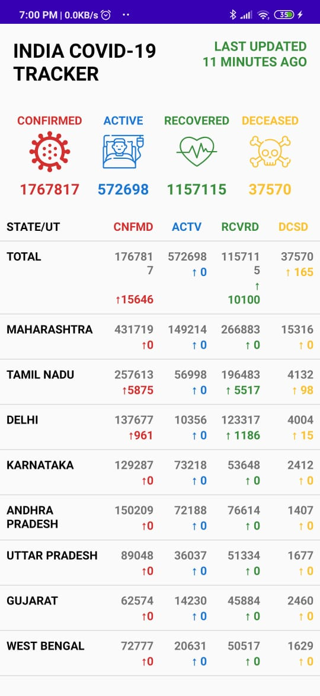

# Covid-Tracker

This is my first kotlin android application. It simply fetches covid stats of India from api and displays it in statewise list.
 
### Snapshot-

 

## Key libraries used-
- [OkHttp](https://square.github.io/okhttp/)
- [GSON](https://github.com/google/gson)
- [Coroutine](https://github.com/Kotlin/kotlinx.coroutines)

 

## Others-
- Spannable String
